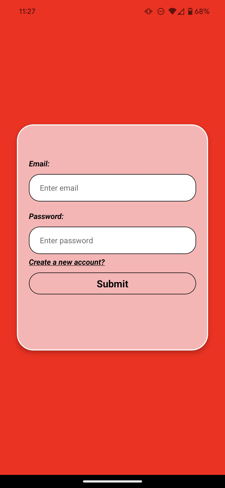
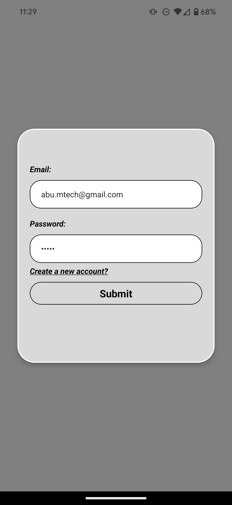
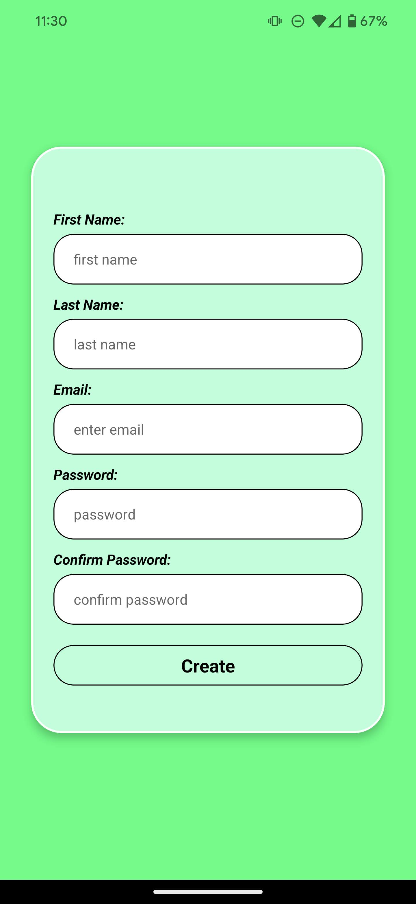
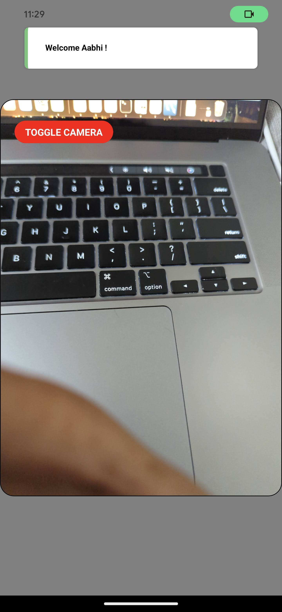
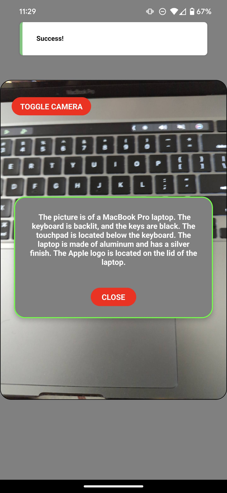

# Lamar
Lamar is a React Native app for recognizing what is in your surrounding. You can take photos and get descriptions for your photos using this app. It uses state of the art Gen AI technology under the hood to provide you with powerful capabilities.

## Setting Up Backend
1. Create MySQL database with the provided schema. The backend code is configured to access the database as "root" user at "localhost" at the default port "3306" with the password "givemeaccess" and database name "ServerAPI". If you set up your database differently, please modify it in server.js.
2. Create Gemini API key, and set is as the enviornment variable "API_KEY" 
3. Run `npm i` to install the relevant packages
4. Run `node server.js` to run your backend server

## Setting Up Frontend
1. Install all the required modules using `npm i`
2. Run: `npm run start` to serve the frontend
2. Install expo go on your Android (preferred) or iOS phone
3. Scan the QR code from the console to launch the app
4. Play with the App!
5. Note: You need to double press the camera for searching the contents in the screen.

### Screenshots of the App!

